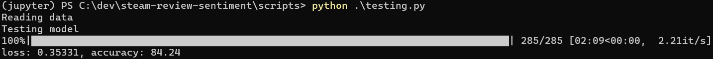

# Sentiment analysis from steam reviews

This project implements a machine learning model for predicting sentiment (voted up/down) from steam reviews text.

**data** folder contains the data and word dictionary used in the model training.

**model** folder contains the trained weights of the RNN model.

**notebooks** folder contains Jupyter Notebook files that are used for data exploration and wrangling, and experimentation with model generation.

**scripts** folder contains Python scripts for processing data, generating dictionary, and training the model.

## Data description

The data is downloaded from https://www.kaggle.com/datasets/kieranpoc/steam-reviews, and not provided in this repository. If you want to try to run the code in this repository, you need to download the data and extract it in the **data** folder.

The dataset contains more than 100 million steam reviews. It contains texts in many languages, but only english language reviews are used in the model.

## Model description

The model is implemented as a Recurrent Neural Network (RNN) with pytorch and torchtext libraries. The RNN processes the review texts token by token (word by word) and outputs a single value for classifying the text sentiment (voted up/down).

## Dependencies

The model is generated with PyTorch and uses FastAPI and Uvicorn for deployment. Use following python libraries with minimum versions:

- torch, 2.1.2
- torchtext, 0.16.2
- pandas, 2.1.4
- tqdm, 4.65.0
- fastapi, 0.103.0
- uvicorn, 0.20.0

With pip, the used packages can be installed with ```pip install -r requirements.txt```

With Anaconda, the used packages can be installed with ```conda create -n <environment-name> --file environment.txt```.

## Data processing and model generation

1. Download data and extract to **data** folder.
2. Execute script **scripts/build_dataset.py**, this generates filtered and splitted datasets in the **data** folder.
3. Execute script **scripts/build_dictionary.py**, this generates files of most used tokens in the reviews in the **data** folder.
4. Execute script **scripts/train_rnn_model.py**, this trains the model and saves model weights to a file.


5. Execute script **scripts/testing.py**, this runs inference on the model with testing data and displays accuracy.



## Model testing

The model can be tested with running the script **scripts/inference.py**.


## Inference API deployment

The inference API can be tested by running ```uvicorn main:app --reload```. The API can then be accessed on [localhost](http://127.0.0.1:8000).

The API provides a HTTP POST method at **/review** path, which can be used for sending text and getting the sentiment as a reply. This can be tested with [FastAPI](http://127.0.0.1:8000/docs).

## Todo

Further assess model performance with confusion matrix and other metrics.

Containerize API and deploy model for public access.

Create a website that uses the API to show outputs from the model.

## Acknowledgements and resources

<a href="https://www.learnpytorch.io">Learn PyTorch for Deep Learning</a>

<a href="https://coderzcolumn.com">CoderzColumn</a>

<a href="http://www.freepik.com">Preview picture designed by vectorjuice / Freepik</a>